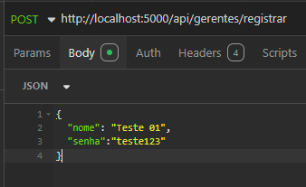
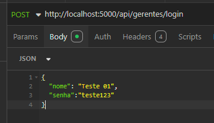
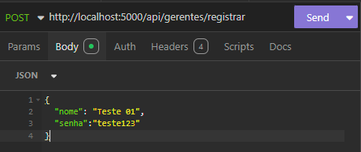
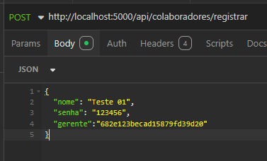
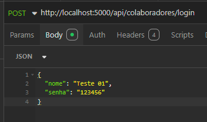
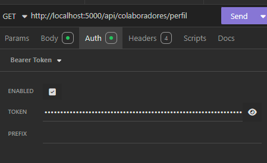
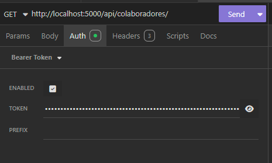
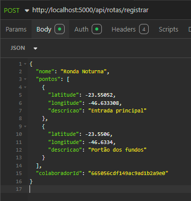
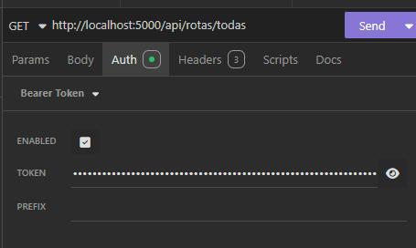

Utilizar nodeJs
Express
JWTToken

✅ Instalar Node.js (vem com o npm)

    Baixe em: https://nodejs.org (versão LTS)

    Instale normalmente.

    Teste no terminal:
node -v
npm -v

✅ Instalar dependências

npm install express jsonwebtoken

TOKENS: 
PEGAR TOKEN DO GERENTE = LOGIN GERENTE - TEMPO DE 1H DE VALIDADE
PEGAR TOKEN DO COLABORADOR = LOGIN COLABORADOR

 POST CRIAR GERENTE

 POST LOGIN DO GERENTE

PEGAR TODOS OS GERENTES - PRECISA DO TOKEN DE ALGUM GERENTE

REGISTRAR GERENTE: 

REGISTRAR COLABORADOR - PRECISA DO ID DO GERENTE

LOGIN COLABORADOR:

LOGIN PERFIL DO COLABORADOR - PRECISA DO TOKEN DO COLABORADOR

PEGAR TODOS OS COLABORADORES - PRECISA DO TOKEN DO GERENTE

REGISTRAR ROTAS

PEGAR TODAS AS ROTAS - PRECISA DE TOKEN DO GERENTE
